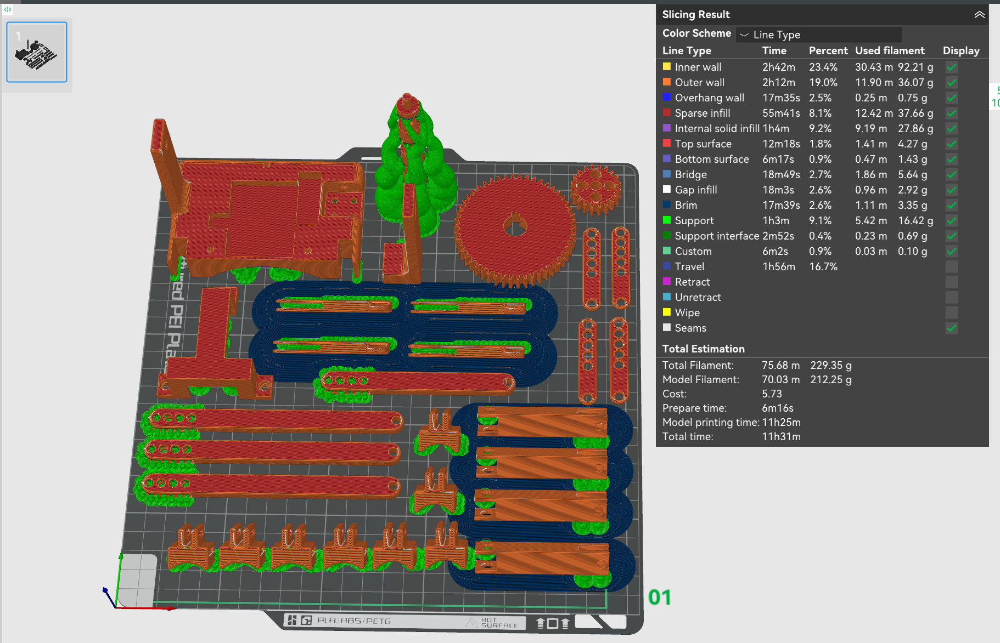

# 🖨️ Print Guide — Hand Exoskeleton

This guide covers the print setup for all 3D-printed parts of the hand exoskeleton. The Bambu Studio `.3mf` project file (`Hand Exo.3mf`) is configured for the **Bambu Lab P1S** and is available in `Print files/BambuStudio/`. It is recommended to view the print in **Line Type** color scheme in Bambu Studio to distinguish support structures from actual part filament before printing.

---

## Print Settings Summary

| Part | Material | Infill | Wall Loops | Notes |
|---|---|---|---|---|
| Wrist Mount | PLA | 15% | 4 | Supports required |
| Motor Mount | PLA | 15% | 4 | — |
| Right Transmission Mount | PLA | 15% | 4 | — |
| Transmission Shaft | PLA | **75%** | 4 | Torque-transmitting part |
| Large Spur Gear (50T) | PLA | **75%** | 4 | Torque-transmitting part |
| Small Spur Gear (20T) | PLA | **75%** | 4 | Torque-transmitting part |
| Base Linkages (×4) | PLA | 15% | 4 | — |
| Intermediate Linkages — Standard 130mm (×3) | PLA | 15% | 4 | Index, middle, ring |
| Intermediate Linkage — Short 100mm (×1) | PLA | 15% | 4 | Pinky finger |
| Vertical Linkages (×4) | PLA | 15% | 4 | — |
| L-Shape Linkages (×4) | PLA | 15% | 4 | — |
| Base Finger Connectors / MCP (×4) | PLA | 15% | 4 | Supports required |
| Small Finger Connectors / PIP+DIP (×4) | PLA | 15% | 4 | Supports required |

> ⚠️ **Critical**: The transmission shaft and both spur gears **must** be printed at 75% infill. These parts carry torsional loads and will fail at lower infill densities.

---

## Print Bed Layout

All parts fit onto a **single Bambu Lab P1S print bed** (256 mm × 256 mm). The `Hand Exo.3mf` project file in `Print files/BambuStudio/` has all parts pre-arranged and pre-configured.

**Total print statistics (from Bambu Studio slice):**

| Parameter | Value |
|---|---|
| Total filament | ~232.53 g |
| Model filament | ~216.94 g |
| Support filament | ~15.11 g |
| Total print time | ~11 hours 25 minutes |
| Estimated cost | ~$5.81 |

  

*Full bed layout shown in Line Type color scheme. Red = part infill and walls. Green = support structures. Blue = brim.*

---

## Part Orientation Guidelines

### Transmission Shaft
Print **horizontal / flat on the bed**. This gives the best layer orientation for torsional strength along the shaft's length and the best surface finish on the shaft geometry. No supports needed.

### L-Shape Linkages, Intermediate Linkages & Finger Connectors (MCP and PIP/DIP)
Print at a **~30° tilt** to minimize the amount of support material needed on the curved and slotted faces. This significantly reduces support cleanup time while maintaining good surface quality on the contact surfaces.

---

## Support Removal Tips

- Use **flush cutters** or **needle-nose pliers** to remove support material from the inside of the finger connector slots. Do not use excessive force — the slot walls are thin.
- For the wrist mount, pay attention to removing supports from the bearing seat in the left transmission mount (integrated). Use a small screwdriver or pick to clear out any remaining support filament.
- After removing all supports, test-fit the ball bearings in both transmission mount seats before final assembly. The bearing should press in with moderate hand pressure — if it falls in freely, the seat is too large; if it doesn't seat, lightly sand or use a heat gun briefly on the plastic around the seat to relax it.

---

## Bed Adhesion

- Use a **smooth PEI plate** for best results with PLA.
- If parts are not adhering, add a **5 mm brim** to the large flat parts (wrist mount, linkages) in Bambu Studio before slicing.
- First layer height: **0.2 mm** (default for PLA in Bambu Studio).

---

[⬆ Back to Main README](../../README.md)
