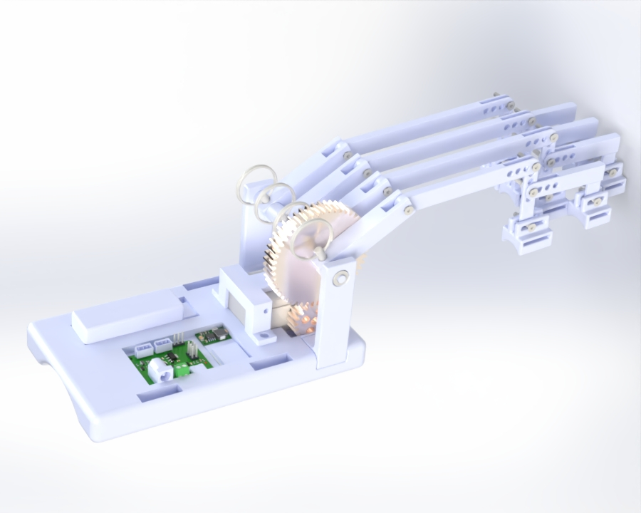
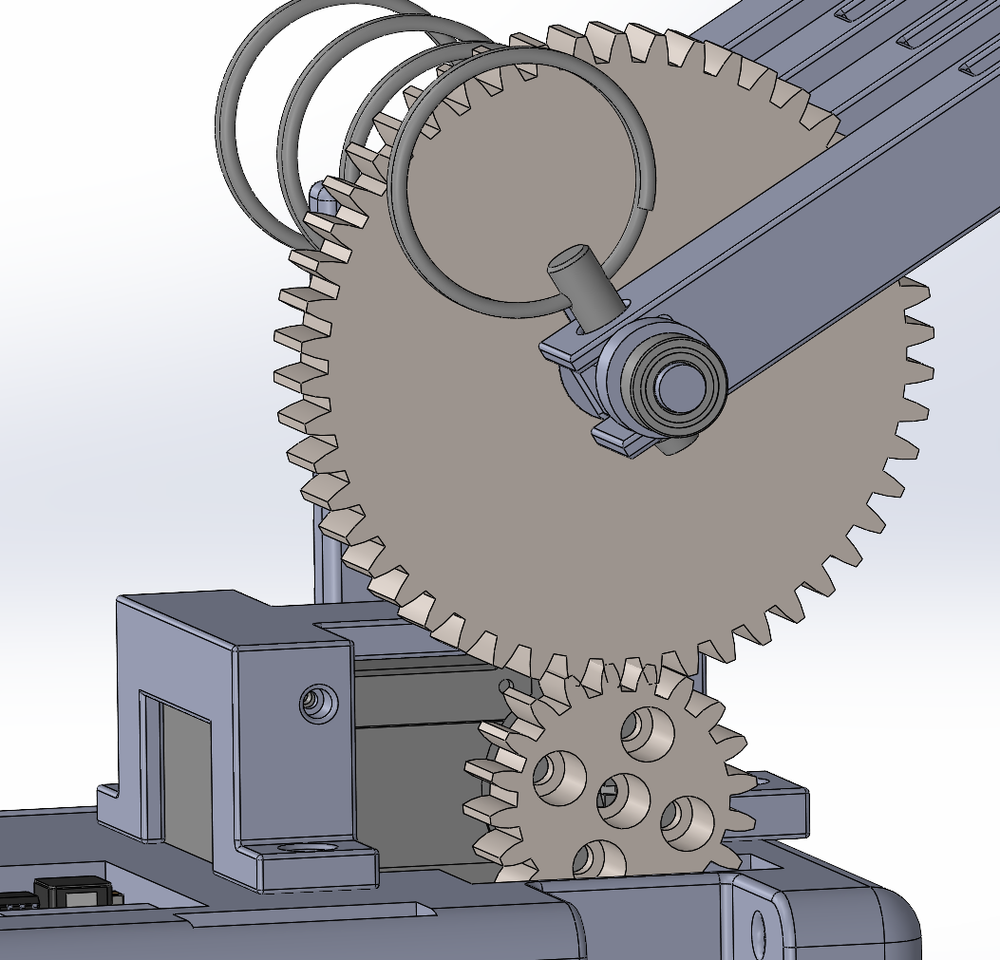
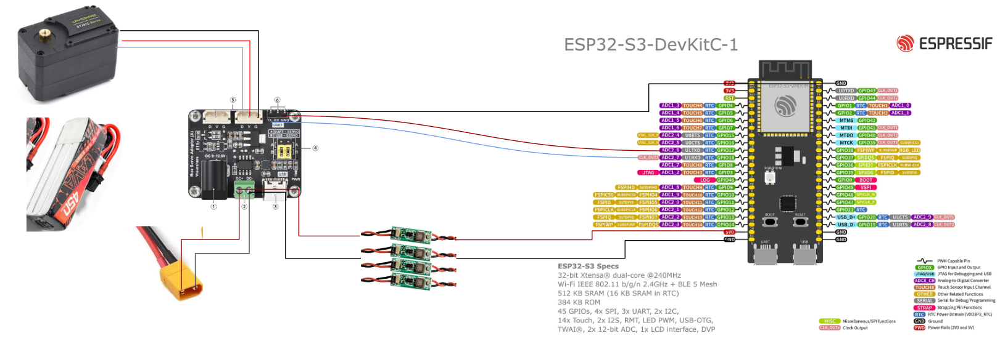

# Hand Exoskeleton — Figueroa Robotics Lab, University of Pennsylvania

<p align="center">
  
</p>

> **Status: Active Development** — Current version supports 4-finger actuation (index, middle, ring, pinky). Thumb integration is ongoing.

---

## Overview

This repository contains all design files, electronics documentation, and assembly instructions for the **Penn GRASP Lab Hand Exoskeleton** — a compact, single-motor, bidirectional hand exoskeleton designed to assist patients who retain partial voluntary hand control (e.g., post-stroke or spinal cord injury patients).

The device targets grip assistance by actuating all four fingers simultaneously through a single Waveshare ST3215 servo motor, a gear transmission, and a parallel four-bar linkage system per finger. All structural components are 3D printed in PLA on a single print bed, keeping cost and fabrication time low while maintaining sufficient mechanical strength for the target torque requirements.

This design draws inspiration from and extends the work of [Esposito et al. (2022) — *Machines*, MDPI](https://www.mdpi.com/2075-1742/10/1/57), adapting it for a more compact, wrist-mounted form factor with a spur gear transmission replacing a Bowden cable mechanism.

---

## Repository Structure

```
hand_exoskeleton/
├── Images/                        # Photos and renders used in this README
├── CAD/
│   ├── Hand Exoskeleton - Left/   # SolidWorks assembly and part files (left hand)
│   └── STL Files/                 # Exported STL files for all printed parts
├── Print Files/
│   ├── BambuStudio/               # `Hand Exo.3mf` — configured for Bambu Lab P1S
│   └── Print Orientation Guide/   # PRINT_ORIENTATION_GUIDE.md + screenshots
├── Datasheets/                    # Datasheets for all electronic components
├── Code/                          # Control code for the hand exoskeleton
└── README.md
```

---

## Table of Contents

1. [Design Overview](#1-design-overview)
2. [Mechanical Design](#2-mechanical-design)
   - [Wrist Mount & Housing](#21-wrist-mount--housing)
   - [Actuation & Gear Transmission](#22-actuation--gear-transmission)
   - [Transmission Shaft & Bearings](#23-transmission-shaft--bearings)
   - [Finger Linkage System](#24-finger-linkage-system)
   - [Finger Connectors](#25-finger-connectors)
   - [Left vs. Right Hand Variants](#26-left-vs-right-hand-variants)
3. [Electronics](#3-electronics)
4. [Bill of Materials](#4-bill-of-materials)
5. [Print & Assembly Guide](#5-print--assembly-guide)
   - [Print Guide](#51-print-guide)
   - [Assembly Procedure](#52-assembly-procedure)
6. [Current Status & Future Work](#6-current-status--future-work)
7. [References](#7-references)

---

## 1. Design Overview

The exoskeleton is designed around the following core goals:

- **Single-motor, 4-finger actuation**: One ST3215 servo drives all four fingers via a shared transmission shaft, keeping the device compact and lightweight.
- **Bidirectional motion**: The motor drives both flexion (closing) and extension (opening) of the fingers.
- **Patient-targeted**: Designed for users who retain partial hand control. The device augments, rather than fully replaces, voluntary effort.
- **Adjustable fit**: Multiple mounting hole positions on each linkage and slot-based connections on finger connectors accommodate a range of finger lengths and hand sizes.
- **Fully 3D-printed structure**: All custom parts are printed in PLA using a single Bambu Lab P1S print bed (~11.5 hours, ~230g filament).

**Grip strength target**: Based on published grip strength data (male average 45 kg, female average 32 kg), the device targets 20 kg (200 N) of assistive grip force. With a 50 mm effective lever arm at the PIP joint, this requires approximately 10 Nm at the output — met by the ST3215's 30 kg·cm (2.94 Nm) stall torque multiplied through the 2.5:1 gear train and the mechanical advantage of the linkage system.

---

## 2. Mechanical Design

### 2.1 Wrist Mount & Housing

The **wrist mount** is the central structural element of the device. It:

- Houses all electronics in a dedicated bay (175 mm × 100 mm × 20 mm, L × W × H)
- Integrates the **left transmission mount** directly into its body
- Provides the motor mounting interface
- Is secured to the user's wrist via **Velcro straps** through dedicated strap channels
- Has a **curved underside** matching the natural curvature of the human wrist for comfort

The wrist mount is printed at **15% infill** except where noted. The electronics bay is open-top for accessibility.

---

### 2.2 Actuation & Gear Transmission

<p align="center">
  
</p>

Actuation uses a **Waveshare ST3215 serial bus servo** in position control mode, selected for its:
- High torque output: **30 kg·cm (2.94 Nm) @ 12V**
- Compact form factor: 45.22 mm × 35 mm × 24.72 mm, **69 g**
- 360° magnetic encoder with 4096-count resolution
- Two-way feedback (position, load, speed, voltage)
- Wide voltage input: 6–12.6V (compatible with 2S or 3S LiPo)
- Serial bus daisy-chain capable (up to 253 servos)

The motor is held in place by a dedicated **motor mount** that is screwed into the wrist mount.

**Gear train** (spur gear pair):

| Parameter | Small Gear (Drive) | Large Gear (Driven) |
|---|---|---|
| Module | 1.25 | 1.25 |
| Tooth Count | 20T | 50T |
| Gear Ratio | — | **2.5:1** |
| Thickness | 10 mm | 10 mm |
| Tooth Depth Modification | +0.5 mm deeper | +0.5 mm deeper |
| Infill | 75% PLA | 75% PLA |
| Mounting | Screwed to motor horn | Keywayed to transmission shaft |

> **Note on tooth depth modification**: Gear teeth are 0.5 mm deeper than the standard SolidWorks Toolbox profile to compensate for dimensional variation in 3D-printed gears and for any motor mount/transmission mount positional offsets. This ensures proper meshing and prevents slip under load.

The small gear is **directly screwed onto the ST3215 motor horn** using the horn's native mounting holes (M2.5 screws). The large gear is **press-fitted** between two fingers on the transmission shaft and secured by a keyway, ensuring full-thickness (10 mm) face-to-face mesh alignment. The motor mount position is adjusted to guarantee proper gear center distance.

---

### 2.3 Transmission Shaft & Bearings

The **transmission shaft** is the main rotating element that distributes torque from the large spur gear to all four finger base linkages.

- Printed at **75% infill** for torsional rigidity
- Mounted at both ends in **stainless steel ball bearings** for smooth, concentric rotation

**Bearing specification:**
- Type: Stainless steel, sealed
- ID: **5 mm** | OD: **10 mm** | Width: **4 mm**
- Sourced from McMaster-Carr

The **left transmission mount** is integrated into the wrist mount body. The **right transmission mount** is a separate printed part that is assembled after the shaft and large gear are in place, and is secured to the wrist mount from both the **bottom** and the **side** with screws. This split-mount design allows the shaft to be slid in laterally during assembly.

---

### 2.4 Finger Linkage System

Each finger uses a **parallel 4-bar linkage** system. This topology, established in the reference MDPI design, converts the rotational motion of the transmission shaft into a guided flexion/extension motion that closely follows the natural kinematics of the human finger.

Four base linkages are mounted to the transmission shaft, spaced **22.5 mm apart** (approximating natural inter-finger spacing). They are connected using **18-8 stainless steel quick-release pins** (McMaster-Carr), which allow any individual finger assembly to be removed instantly without tools by simply pulling the pin — far faster than unscrewing a fixed connection.

**Linkage chain per finger** (proximal to distal):

```
Transmission shaft
      │
  Base Linkage (65.4 mm)     ← Quick-release pin to shaft
      │
  Intermediate Linkage        ← M3 screw connection
  (100 mm — pinky | 130 mm — other fingers, max length)
      │
  Vertical Linkage (50 mm)   ← Multiple hole positions for adjustability
      │                         Both at top (to intermediate) and bottom (to connectors)
  ├── Base Finger Connector (MCP)   ← Slot connection for fine adjustment
  └── L-Shape Linkage (60 mm W × 28 mm L)  ← Middle holes of vertical linkage
           │
      Small Finger Connector (PIP/DIP)  ← Slot connection
```

**Key design decisions:**
- **Multiple hole positions** on the intermediate linkage end and vertical linkage allow adjustment to the user's finger length.
- **Slot connections** (rather than fixed holes) at the finger connector interfaces provide continuous adjustability for even finer fit customization.
- **PIP and DIP treated as one joint**: Rather than separate connectors for each phalanx, only two connectors are used — one at MCP and one spanning PIP/DIP — simplifying the design while maintaining functional grip guidance.
- The pinky finger uses a **shorter intermediate linkage (100 mm)** to match the shorter length of the fifth finger; all other fingers use 130 mm.

All linkage connections use **M3 screws and nuts** throughout except where quick-release pins are specified.

---

### 2.5 Finger Connectors

Two connector types are used per finger:

**Base Finger Connector (MCP)** — Large connector that attaches above the knuckle (metacarpophalangeal joint):
- Velcro-taped to the dorsal surface of the finger just proximal to the knuckle
- **Curved bottom surface** matching the natural convexity of a human finger
- Slot interface to the vertical linkage

**Small Finger Connector (PIP/DIP)** — Smaller connector that spans the proximal and distal interphalangeal joints:
- Attached to the dorsal proximal phalanx / middle phalanx region
- Also **curved** to conform to finger geometry
- Slot interface to the L-shape linkage

---

### 2.6 Left vs. Right Hand Variants

The device is designed as a left hand model. A right hand version is a simple mirror of the design — the only structural difference is the **position of the pinky (short) linkage**:

| Variant | Pinky linkage position |
|---|---|
| Left hand (current model) | Leftmost position |
| Right hand (future work) | Rightmost position |

The right hand CAD files will be added in a future update once the left hand design is fully validated and finalized.

---

## 3. Electronics

The electronics are housed in the wrist mount bay and consist of the following system:

<p align="center">
  
</p>

### Power Architecture

```
3S LiPo Battery (12V, 400–600 mAh, XT30)
          │
          ├──▶ Waveshare Bus Servo Adapter A (12V direct) ──▶ ST3215 Servo
          │
          └──▶ Voltage Step-Down (12V → 5V) ──▶ ESP32-S3 (Adafruit Feather)
```

### Component List

| Component | Description | Link |
|---|---|---|
| **Waveshare ST3215 Servo** | 30 kg·cm @ 12V, 360° encoder, serial bus | [Waveshare](https://www.waveshare.com/st3215-servo.htm) |
| **Waveshare Bus Servo Adapter A** | Serial bus interface, 12V servo power supply | [Waveshare](https://www.waveshare.com/bus-servo-adapter-a.htm) |
| **ESP32-S3 (Adafruit Feather S3)** | Microcontroller, 5V, Wi-Fi + BLE, UART servo control | [Adafruit #5364](https://www.adafruit.com/product/5364) |
| **Step-Down Converter (Mini360)** | 12V → 5V buck converter for ESP32 | [Amazon](https://www.amazon.com/ALMOCN-Mini360-Voltage-Converter-4-75V-23V/dp/B08HQDSQZP) |
| **3S LiPo Battery** | 12V, 400–600 mAh, XT30 connector, ~38g | [Pyrodrone](https://pyrodrone.com/collections/3s-batteries/products/betafpv-lava-3s-450mah-75c-xt30-battery-2pcs) |
| **XT30 Pigtail** | Battery connector pigtail | [Amazon](https://www.amazon.com/xt30-pigtail/s?k=xt30+pigtail) |
| **Waveshare Bus Servo Driver Hat A** | Alternative Raspberry Pi–compatible driver hat | [Waveshare](https://www.waveshare.com/bus-servo-driver-hat-a.htm) |

> **Future development**: A custom PCB integrating the step-down converter, ESP32, and bus servo adapter into a single wrist-mount-sized board is planned for a later hardware revision.

### Wiring Notes

- The ST3215 communicates over **half-duplex UART** (TTL serial) at up to 1 Mbps. The Bus Servo Adapter A handles the TX/RX level-shifting and provides 12V motor power.
- The ESP32-S3 is powered from the 5V step-down output and communicates with the servo adapter via UART.
- A **decoupling capacitor** should be added between V+ and GND on the servo power rail in the final circuit to suppress voltage spikes during motor commutation.
- All electronics are seated on standoffs inside the wrist mount bay and can be accessed by removing the wrist mount cover.

---

## 4. Bill of Materials

### Purchased Hardware

| Item | Specification | Source | Qty | Unit Cost (USD) |
|---|---|---|---|---|
| Waveshare ST3215 Servo | 30 kg·cm @ 12V, 360° encoder, serial bus | Waveshare | 1 | ~$25 |
| Ball Bearing | SS, 5mm ID × 10mm OD × 4mm W, sealed | McMaster-Carr | 2 | ~$5 ea |
| Quick-Release Pin | 18-8 SS, sized to base linkage holes | McMaster-Carr | 4 | ~$2 ea |
| M3 Screw & Nut Set | Various lengths (6 mm, 10 mm, 16 mm) | McMaster-Carr / Amazon | ~40 | — |
| M2.5 Screw | For motor horn attachment to small spur gear | McMaster-Carr | 4 | — |
| Velcro Straps | Hook-and-loop, wrist and finger attachment | Amazon | — | ~$8 |
| Waveshare Bus Servo Adapter A | 12V bus servo power + UART interface | Waveshare | 1 | ~$15 |
| ESP32-S3 Feather (Adafruit #5364) | 5V, Wi-Fi + BLE | Adafruit | 1 | ~$25 |
| Mini360 Buck Converter | 12V → 5V step-down | Amazon | 1 | ~$2 |
| 3S LiPo Battery | 400–600 mAh, XT30, ~38g | Pyrodrone / Amazon | 1 | ~$15 |
| XT30 Pigtail | Battery connector | Amazon | 1 | ~$3 |
| Misc (wires, standoffs, heat shrink, plugs) | — | — | — | ~$10 |

### 3D-Printed Parts

All parts are printed in **PLA** unless otherwise noted.

| Part | Qty | Infill | Notes |
|---|---|---|---|
| Wrist Mount | 1 | 15% | Electronics bay + left transmission mount integrated |
| Motor Mount | 1 | 15% | — |
| Right Transmission Mount | 1 | 15% | Separate piece; slides over shaft |
| Transmission Shaft | 1 | **75%** | Torque-transmitting; keywayed |
| Large Spur Gear (50T, M1.25) | 1 | **75%** | +0.5 mm tooth depth, keywayed |
| Small Spur Gear (20T, M1.25) | 1 | **75%** | +0.5 mm tooth depth, motor horn mount |
| Base Linkage | 4 | 15% | 65.4 mm, one per finger |
| Intermediate Linkage — Standard (130 mm) | 3 | 15% | Index, middle, ring fingers |
| Intermediate Linkage — Short (100 mm) | 1 | 15% | Pinky finger |
| Vertical Linkage | 4 | 15% | 50 mm, multiple mounting holes |
| L-Shape Linkage | 4 | 15% | 60 mm W × 28 mm L |
| Base Finger Connector (MCP) | 4 | 15% | Large connector; curved underside |
| Small Finger Connector (PIP/DIP) | 4 | 15% | Smaller connector; curved underside |

> **Total estimated filament**: ~213g (model), ~230g total including support | **Print time**: ~11.5 hours on Bambu Lab P1S (single bed)

---

## 5. Print & Assembly Guide

### 5.1 Print Guide

See [`Print Files/Print Orientation Guide/PRINT_ORIENTATION_GUIDE.md`](Print%20Files/Print%20Orientation%20Guide/PRINT_ORIENTATION_GUIDE.md) for the complete print setup, bed layout screenshots, and per-part orientation guidance.

**Summary:**

| Print Bed | Parts Included | Infill | Material |
|---|---|---|---|
| Bed 1 (single plate) | All parts combined | Mixed (see BOM above) | PLA |

- Gears and transmission shaft: **75% infill**, 4 wall loops
- All other parts: **15% infill**, 4 wall loops
- All parts fit on a **single Bambu Lab P1S bed** (~256 mm × 256 mm)
- Supports are required on the wrist mount and finger connectors; remove carefully after printing

> **Tip**: View `Hand Exo.3mf` in **Line Type** color scheme in Bambu Studio to distinguish support material from part material before starting the print.

---

### 5.2 Assembly Procedure

**Before assembly, gather:**
- All 3D-printed parts (supports removed and cleaned up)
- 2× stainless steel ball bearings (5mm ID × 10mm OD × 4mm)
- 4× 18-8 SS quick-release pins
- M3 screws and nuts (various lengths)
- M2.5 screws (for motor horn)
- Velcro straps (wrist and finger)
- All electronic components

---

**Step 1 — Assemble all four finger linkage systems**

For each finger, assemble in the following order:

1. Attach the **base linkage** to the quick-release pin (do not install on shaft yet)
2. Connect the **intermediate linkage** to the base linkage via M3 screw and nut — select the appropriate hole on the intermediate linkage for the user's finger length
3. Connect the **vertical linkage** to the intermediate linkage via M3 screw and nut through the chosen hole position
4. Slide the **base finger connector (MCP)** onto the slot of the vertical linkage and secure with M3 screw and nut
5. Attach the **L-shape linkage** to the middle holes of the vertical linkage via M3 screw and nut
6. Slide the **small finger connector (PIP/DIP)** onto the slot of the L-shape linkage and secure with M3 screw and nut

Repeat for all four fingers. Use the shorter intermediate linkage (100 mm) for the pinky.

---

**Step 2 — Prepare the motor**

Screw the **small spur gear (20T)** onto the ST3215 motor horn using M2.5 screws through the horn's native mounting holes. Ensure the gear seats flush against the horn face.

---

**Step 3 — Mount the motor**

Place the **motor** into the **motor mount** and secure with screws. Then mount the motor mount assembly into the wrist mount and screw it down.

---

**Step 4 — Install the large spur gear**

Press-fit the **large spur gear (50T)** into the gap between the two transmission shaft fingers on the wrist mount, aligning the keyway. The gear should be fully seated with its full 10 mm face engaged.

---

**Step 5 — Attach finger linkages to the transmission shaft**

Slide all four finger base linkages onto the transmission shaft at 22.5 mm spacing, aligning with their respective positions. Insert the **quick-release pins** through each base linkage and transmission shaft to secure them.

---

**Step 6 — Install the transmission shaft and bearings**

1. Press one ball bearing into the **right transmission mount** bearing seat and one into the integrated bearing seat on the **left transmission mount** (built into the wrist mount)
2. Slide the **transmission shaft** through the left bearing, through the gear, and into the right bearing
3. Screw the **right transmission mount** to the wrist mount from the bottom and the side using the designated screw holes

---

**Step 7 — Verify gear mesh**

Manually rotate the motor horn to confirm smooth meshing between the small and large spur gears. There should be no binding or excessive play. If necessary, adjust the motor mount position slightly to optimize center distance.

---

**Step 8 — Install electronics**

Seat all electronics components (ESP32, Bus Servo Adapter, step-down converter, battery) into the wrist mount electronics bay on standoffs. Connect wiring per the wiring diagram in Section 3.

---

**Step 9 — Don the device**

1. Place the wrist mount on the dorsal surface of the wrist and secure with **Velcro straps**
2. Align the MCP finger connectors just proximal to each knuckle and attach with **Velcro straps**
3. Align the PIP/DIP finger connectors on the middle phalanx region and attach with **Velcro straps**
4. Confirm that all linkages move freely through the range of motion without pinching

---

**Step 10 — Power on and test**

Connect the battery and power on the device. Command the servo to flex and extend the fingers to verify full range of motion and confirm no binding in the linkage system.

---

## 6. Current Status & Future Work

| Item | Status |
|---|---|
| 4-finger mechanical design (left hand) | ✅ Complete |
| Gear transmission + transmission shaft | ✅ Complete |
| Electronics architecture | ✅ Defined |
| Physical assembly & first hardware build | ✅ Complete |
| Smooth finger actuation (linkage kinematics refinement) | 🔄 In progress — current design does not yet produce smooth motion when motor is actuated; linkage geometry and transmission tuning ongoing |
| Wrist mount housing optimization | 🔄 In progress — current wrist mount is first-pass geometry; electronics mounting, cable routing, and cover design not yet finalized |
| Right hand variant CAD | 🔲 Future work |
| Thumb integration | 🔲 Future work |
| EMG-based control | 🔲 Future work |
| Custom PCB (integrated electronics) | 🔲 Future work |
| Clinical testing / patient trials | 🔲 Future work |

---

## 7. References

- Esposito, D. et al. (2022). *A Mechanical Hand Exoskeleton for Rehabilitation of Post-Stroke and SCI Patients*. Machines, 10(1), 57. [https://www.mdpi.com/2075-1742/10/1/57](https://www.mdpi.com/2075-1742/10/1/57)
- Waveshare ST3215 Servo: [https://www.waveshare.com/st3215-servo.htm](https://www.waveshare.com/st3215-servo.htm)
- Grip strength reference data: Leyk et al. (2007), [Springer](https://link.springer.com/article/10.1186/s12891-015-0612-4/tables/2)

---

*Developed at the [Figueroa Robotics Lab](https://github.com/penn-figueroa-lab), University of Pennsylvania GRASP Laboratory.*  
*Website template borrowed from [Nerfies](https://github.com/nerfies/nerfies.github.io).*
